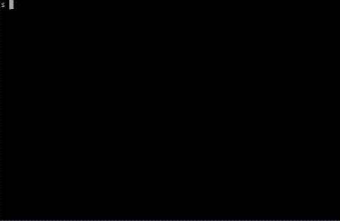

# TB

**TB** ("Tree Browser" or "tuberculosis") is a Curses-style interactive command-line browser for JSON and other tree-structured
data.  It's inspired by Firefox's built-in JSON browser and the tree views available in various UI libraries, but it's better
by virtue of running in the terminal.

## How to Use

The easiest thing is probably to download the precompiled binary from the releases page.  It should be mostly dependency-free.

If you have the Rust toolchain installed, you can clone this repository and build from scratch:

    git clone https://github.com/showermat/tb
    cd tb
    cargo build --release

I expect people mostly just want to browse JSON.  If that's you, rename the binary to `jb` and stick it somewhere in your `$PATH`.
Then, run it with your file as the only argument, or pipe in some JSON:

    mv target/release/tb ~/bin/jb
    chmod +x ~/bin/jb
    echo "[1, 2, 3]" | jb

## Other Backends

JSON is TB's primary target, but it can also be used to browse other tree-structured data, if an appropriate backend exists.  To
list the available backends, make sure the binary is named `tb` and run `tb help`:

    $ tb help
    tb 0.4.0
    Command-line interactive browser for JSON and other tree-structured data
    Copyright (GPLv3) 2019 Matthew Schauer <https://github.com/showermat/tb>

    Usage: tb help|<backend> [backend args...]

    Available backends:
        fs          Browse the file system (built-in)
        j           Browse JSON documents (built-in)
        rand        Create a tree of random and ever-changing nonsense (from /home/me/.local/share/tb/plugins/libtb_sample_plugins.so)

We can see two bult-in backends, the JSON one and one for browsing the file system.  To invoke a particular backend, supply it as
the first argument, followed by any backend-specific arguments:

    tb fs /

Or, invoke the application as `<backend-name>b`:

    mv tb fsb
    ./fsb /

In the output above, there's also a backend loaded from a plugin file.  This is just a dynamic library containing an implementation
of the the tree interfaces.  This is written as a normal Rust library, compiled as a dynamic library, and placed in the plugin
directory (`$XDG_DATA_HOME/tb/plugins` by default).  For more information about writing plugins, see the documentation in
`tb-interface/src/lib.rs`, or browse the `tb-sample-plugins` directory for some working examples.

## Road Map

  - TODO
      - In nobreaks: clip lines too long to fit, allow hard wraps (then remove testing nobreak from rand backend)
      - Support resizing in prompt
      - Retrieve children in a separate thread and display a "Loading..." node if it takes more than 0.1 seconds
  - Future
      - Configure: colors, key bindings, tab and indentation sizes, whether to search with regex, mouse scroll multiplier, backend
        regex
      - jq integration: https://crates.io/crates/json-query
      - Support monochrome mode in curses.rs
  - Ideas
      - ncurses replacement: https://github.com/TimonPost/crossterm https://github.com/redox-os/termion
      - Allow backends to register custom keybindings and config items
  - Bugs
      - Serde doesn't give us object elements in document order.  Is there any way to achieve this?
      - Plugin note: When building with crate_type = dylib, there are two issues that I haven't fixed yet: a segfault on exit in
        `__call_tls_dtors` (only after using a backend loaded from a plugin), and the plugin dynamically linking Rust's stdlib.so,
        which it then can't find unless I set LD_LIBRARY_PATH.  Both of these are fixed by using crate_type cdylib, so I'm doing
        that for now, but I'm not sure what further ramifications making that change has.

## Credits

TB is written by solely by Matthew Schauer and released under the terms of the GNU General Public License, version 3.  The text of
the GPLv3 can be found at <https://www.gnu.org/licenses/gpl-3.0.en.html>.
